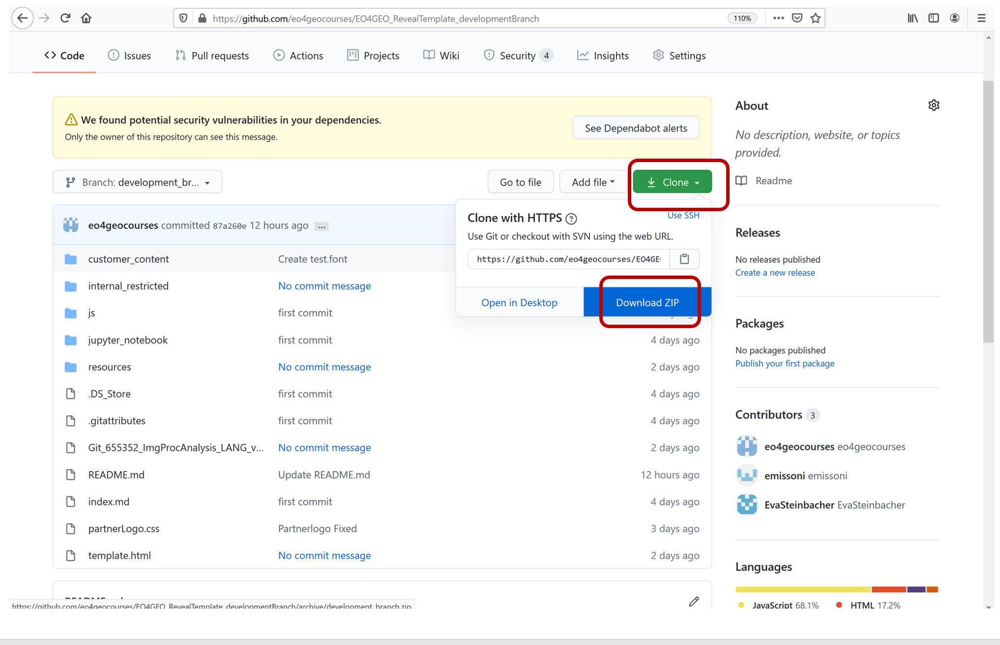

# Information on using github for the collection of eo4geo training material content 

The following guidelines apply to eo4geo partners who contribute training material content on the basis of the Reveal JS template: 

* <strong>To create your own training material </strong> deriving from the EO4GEO_RevealTemplate_developmentBranch, follow the instructions below:
   1.  download the package, develop your material (locally on your desktop) on basis of the template. 
   
   2. Copy the code of the template.html into the <strong> index.html </strong>. The index.html is the file to develop your content --> it can be used by Github Pages to automatically create Websites in the later course when using repositories for each partner.
   3. Repositories for each partner will be made available to save your content there. More information on this is following.
  
* The template might be issue to updates and fixes. If this is the case, you can accept these changes for your versions by updating your feature branch from the development branch
Please DO NOT alter the original "EO4GEO_RevealTemplate_developmentBranch" 
* If you consider particular changes/adaptions to the template are necessary or advisable, please get in contact with PLUS or - if you found a solution: Great! Upload it to your branch and pass a pull-request to us.
* <strong> Information on How-To Use Reveal and a channel for Q&A about the use of Reveal JS can be found in the folowing Slack channel: wp4_reveal_question_and_answer https://app.slack.com/client/T8X5JBEFJ/G015RL4SSUW  </strong>

